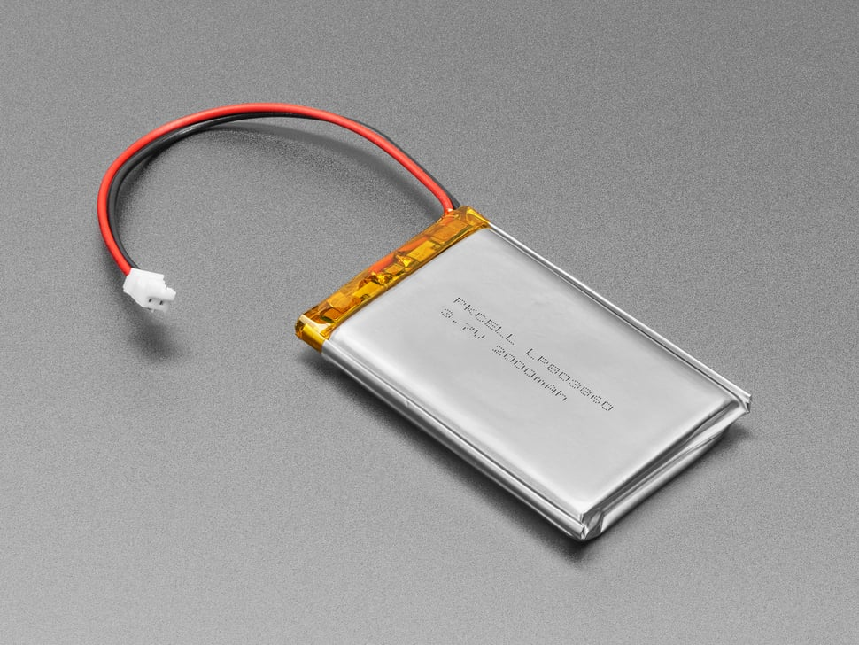

# This is the circuit design

The circuit design uses these parts: 

1. A main board containing an Adafruit ESP32-S3 Feather and connection headers
for a servo  and the  keypad  (there is a  STEMMA/QWIC  connector  for the I2C
connection to the Display Module on th Feather board).  The Adafruit  ESP32-S3
Feather  includes a JST battery  connection and includes a LiPo battery charge
circuit.

2.  A  display  module  with  a  HT16K33   breakout  and  4  dual   14-segment
alphanumberic display modules.

3.  A 12-key keypad board.

4. A high torque metal gear servo will be used to operate a lock.

5. A LiPo battery

